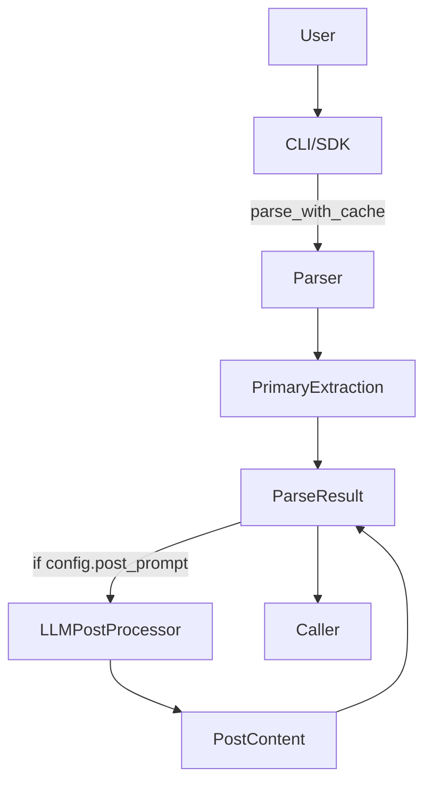

# Technical Design Document (TDD)

## Feature: Post-Parse Prompting (PPP)
### Doc Parser – Version 0.1

---

### 1. High-Level Architecture



* **Parser** – Any concrete parser (PDF, DOCX, etc.)
* **PrimaryExtraction** – Existing logic (vision OCR, pandas, etc.)
* **LLMPostProcessor** – New component; single responsibility: run secondary prompt, validate, cache.
* **CacheManager** – Re-used for both primary and post caches (different keys).

---

### 2. Key Components

| Component | Type | Responsibility |
|-----------|------|----------------|
| `ParserConfig` | Dataclass | Hold PPP settings (`post_prompt`, `response_model`, `post_use_cache`). |
| `ParseResult` | Dataclass | Add `post_content`, `post_errors`. |
| `LLMPostProcessor` | Class | Resolve prompt, execute OpenAI call, optional Pydantic validation, return `(content, errors)`. |
| `cli.main` | CLI layer | Parse flags, inject into `ParserConfig`, format output. |
| `utils/import_utils.py` | Helper | Dynamically import class from dotted path (`mypkg.Schema`). |

---

### 3. Detailed Design

#### 3.1 `ParserConfig` additions
```python
@dataclass
class ParserConfig:
    # ... existing ...
    post_prompt: Optional[str] = None
    response_model: Optional[str] = None  # dotted path
    post_use_cache: bool = True
```
* Handled in `__post_init__`; no dir creation needed.

#### 3.2 `ParseResult` additions
```python
@dataclass
class ParseResult:
    # existing fields ...
    post_content: Any = None
    post_errors: List[str] = field(default_factory=list)
```

#### 3.3 `LLMPostProcessor`
```python
class LLMPostProcessor:
    def __init__(self, config: ParserConfig):
        self.client = AsyncOpenAI(api_key=config.api_key)
        self.model_name = config.model_name
        self.use_cache = config.post_use_cache
        self.cache = CacheManager(config.cache_dir)

    async def run(self, markdown: str, prompt: str, response_model_path: Optional[str]) -> Tuple[Any, List[str]]:
        key = sha256(markdown+prompt+str(response_model_path)+self.model_name)
        if self.use_cache:
            cached = await self.cache.get(key)
            if cached:
                return cached["content"], []

        messages = [
            {"role": "system", "content": "You are Post-Parser"},
            {"role": "user", "content": prompt.replace("{{input}}", markdown)}
        ]
        try:
            resp = await run_with_retry(self.client.chat.completions.create,
                                        model=self.model_name,
                                        messages=messages,
                                        temperature=0)
            raw = resp.choices[0].message.content
        except Exception as e:
            return None, [str(e)]

        # optional validation
        if response_model_path:
            model_cls = import_from_path(response_model_path)  # helper
            try:
                obj = model_cls.parse_raw(raw)
                content = obj.dict()
            except Exception as e:
                return raw, [f"Validation error: {e}"]
        else:
            content = raw

        if self.use_cache:
            await self.cache.set(key, {"content": content})
        return content, []
```

#### 3.4 Parser Integration
In `BaseParser.parse_with_cache` **after** obtaining `result = await self.parse(...)`:
```python
if (prompt := kwargs.get("post_prompt") or self.config.post_prompt):
    processor = LLMPostProcessor(self.config)
    post_content, errors = await processor.run(result.content, prompt, self.config.response_model)
    result.post_content = post_content
    result.post_errors = errors
```

Alternatively patch each concrete parser—minimal risk.

#### 3.5 CLI Extension
```bash
parse_pdf parse <file> -P "Summarize above in JSON" \
            --response-model mypkg.schemas.Summary \
            --no-post-cache
```
Implementation steps:
1. Add new Click options in `cli/main.py`.
2. Pass values into `parse_document` then via `ParserConfig`.
3. Print secondary output.

#### 3.6 Dynamic Model Import
`utils.import_utils.import_from_path(path: str) -> Type[BaseModel]`
* Split by last dot, `importlib.import_module`.
* Raise helpful error if not found.

#### 3.7 Caching Strategy
* Use same directory (`cache/`).
* Keys suffixed `_post` optional.
* TTL inherits existing CacheManager rules.

---

### 4. Concurrency & Rate-Limiting
* `LLMPostProcessor` relies on existing `RateLimiter` to respect `config.max_workers` (wrap call in semaphore).
* Processes are sequential per ParseResult but parsers operate concurrently at batch level.

---

### 5. Testing Strategy
1. **Unit**
   * Mock AsyncOpenAI to return fixed JSON.
   * Validate Pydantic pass/fail.
2. **Integration**
   * Parse sample PDF, run post prompt; assert `post_content` not None.
3. **CLI**
   * Use Click runner with `--post-prompt`.
4. **Cache**
   * Ensure second run pulls from cache (time delta check).

---

### 6. Migration & Compatibility
* Optional fields ensure old code continues functioning.
* Version bump, changelog.

---

### 7. Risks & Mitigations
| Risk | Impact | Mitigation |
|------|--------|-----------|
| Large payload sent to LLM | Cost/perf | Allow prompt to truncate or summarise input first. |
| Validation failures | Poor UX | Bubble errors, allow raw text fallback. |
| API rate limits | Delays | Use existing RateLimiter and exponential backoff. |

---

### 8. Open Questions
* Multi-step chains? (out of scope)
* Alternative providers (Anthropic, Groq) – abstraction later.

---

### 9. Timeline (same as PRD)

| Week | Tasks |
|------|-------|
| 1 | Core classes, config, tests |
| 2 | Parser integration, CLI, docs |
| 3 | Polish, examples, release |

---

### 10. Appendix
* Example `response_model` definition:
```python
from pydantic import BaseModel
class BulletSummary(BaseModel):
    bullets: list[str]
```
* Prompt template may include `{{input}}` placeholder replaced with full markdown. 